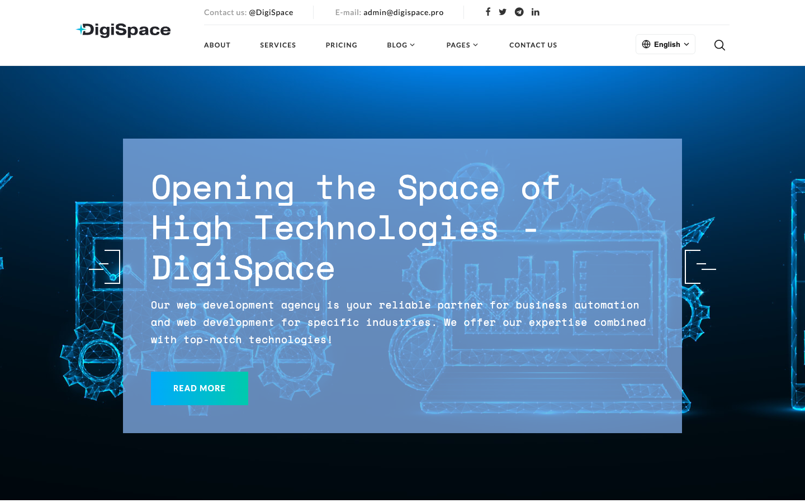
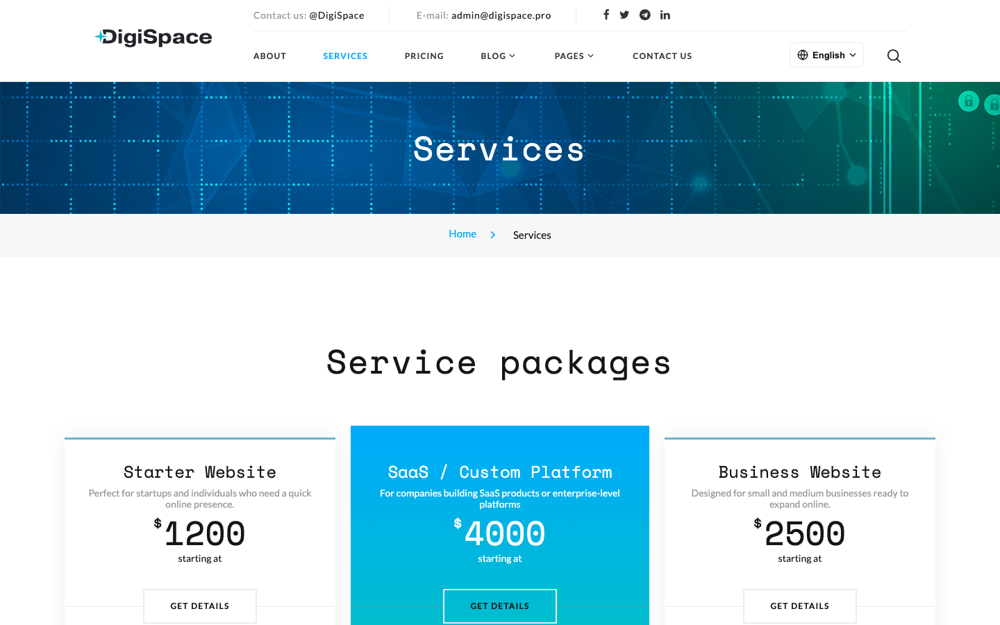
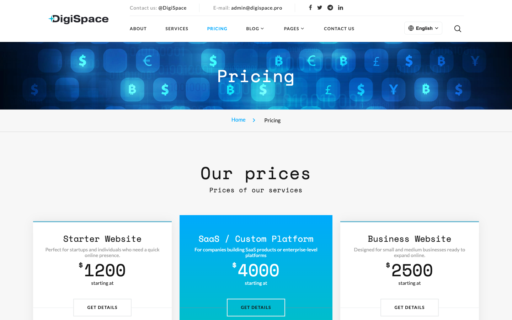
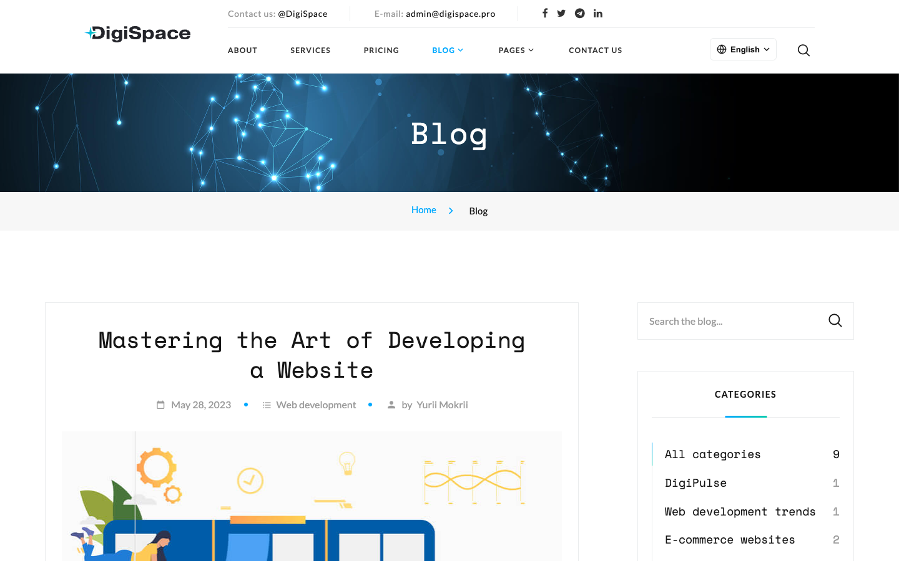
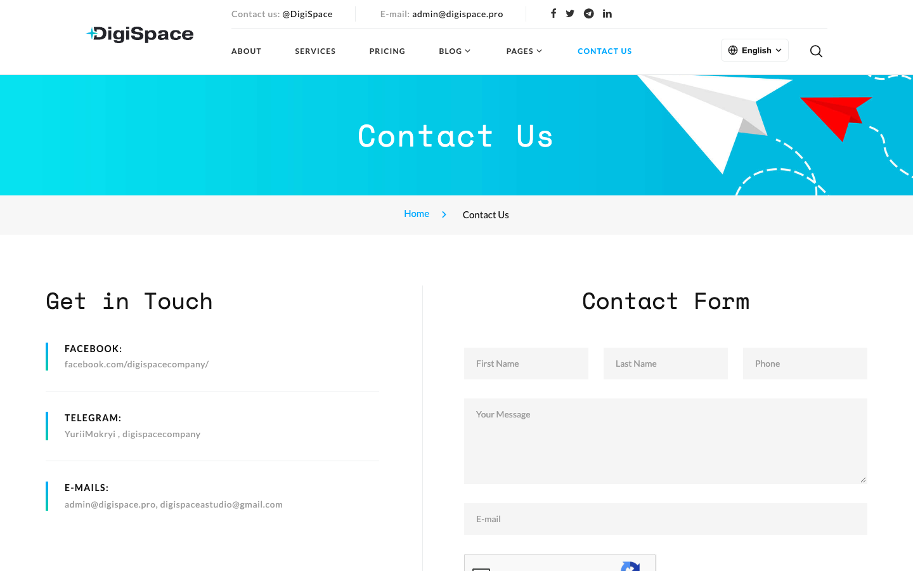
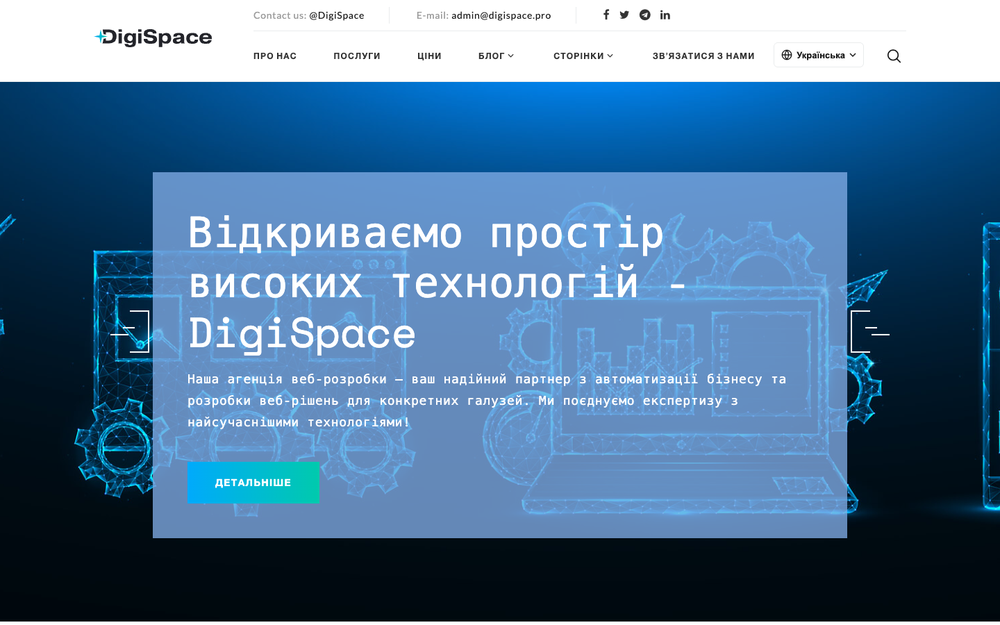
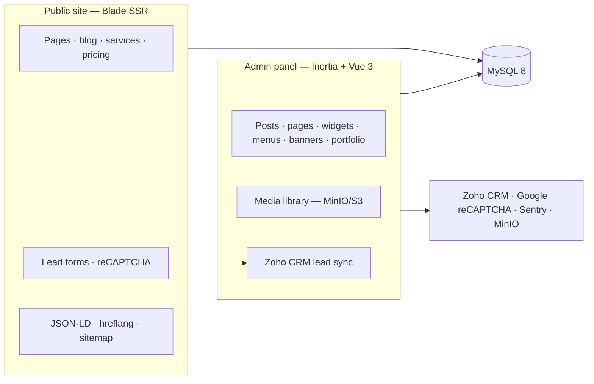

# DigiSpace

Company website, blog and service catalogue for [digispace.pro](https://digispace.pro), with a built-in admin panel — a full custom CMS, not a themed template.

**Stack:** Laravel 13 · PHP ^8.3 · MySQL 8 · Blade (public site) · Inertia.js + Vue 3 (admin) · Vite · Tailwind · Sanctum

**Live:** [digispace.pro](https://digispace.pro) — production, multilingual (EN / UK / PL)

## Screenshots

| Home (EN) | Services | Pricing |
|---|---|---|
|  |  |  |

| Blog | Contact form | Home (UK) |
|---|---|---|
|  |  |  |

## Architecture



Domain behaviour is specified in [`openspec/specs/`](openspec/specs/) — public-site UX, admin content editing, localization and content generation, verified against the code.

## Quick start

```bash
cp .env.example .env            # only if .env does not already exist
# Set APP_SERVICE=digi-space-app, APP_PORT=8100, DB_HOST=digi-space-db.
# Configure credentials and integrations: see docs/local-setup.md.
composer install
npm install
vendor/bin/sail up -d           # PHP 8.3 + MySQL 8, app on http://localhost:8100 with the settings above
vendor/bin/sail artisan key:generate
vendor/bin/sail artisan migrate
# For a clean local database, use LocalDevelopmentSeeder (see docs/local-setup.md).
vendor/bin/sail artisan db:seed --class=LocalDevelopmentSeeder
npm run dev
```

Admin panel: `/login` → `/admin` (users come from `database/seeders/UserSeeder.php`; self-registration is disabled).

## Repository map

| Path | Purpose |
|---|---|
| `app/Http/Controllers/` | Public Blade controllers (home, about, services, blog, contact, pages) |
| `app/Http/Controllers/Admin/` | Inertia admin controllers (posts, widgets, pages, services, products, menus, banners, portfolio) |
| `app/Services/`, `app/Repositories/` | Query/formatting helpers used by controllers |
| `app/View/Components/` + `resources/views/components/` | Blade components that render widget categories (footer, header, "choose us", FAQ, …) |
| `resources/js/Pages/Admin/` | Vue pages for the admin panel (resolved by `Inertia::render('Admin/...')`) |
| `config/constants.php` | IDs of seeded widget categories / menus the public site depends on |
| `database/seeders/` | Historical content seeders plus the guarded `LocalDevelopmentSeeder` for clean local setup |
| `.github/workflows/deploy.yml` + `deployment-config.json` | Release-symlink deploy to CloudPanel servers |
| `docs/` | Project documentation — start at [`docs/README.md`](docs/README.md) |
| `CLAUDE.md` | Guidance for AI coding agents (architecture, conventions, gotchas) |

## Common commands

```bash
vendor/bin/sail exec -T digi-space-app vendor/bin/phpunit  # PHPUnit (needs a `testing` MySQL database — see docs/testing.md)
vendor/bin/phpstan analyse                # Larastan, level 5
vendor/bin/pint --dirty                   # code style
vendor/bin/sail artisan sitemap:generate  # public/sitemap.xml (also scheduled daily)
npm run build                             # production assets
```

## Documentation

- [Analysis and known gaps](docs/project-analysis.md)
- [Architecture](docs/architecture.md)
- [Content model (widgets, pages, menus)](docs/content-model.md)
- [Local setup](docs/local-setup.md)
- [Testing](docs/testing.md)
- [Deployment](docs/deployment/README.md)
- [Integrations (Zoho CRM, reCAPTCHA, MinIO, Sentry, TinyMCE)](docs/integrations.md)

## Explore & contact

- **[Live site](https://digispace.pro)** — production (EN / UK / PL)
- **[Domain specs](openspec/specs/)** — behavioural contracts in the project's OpenSpec format
- **[Docs](docs/README.md)** — architecture, content model, integrations, deployment

Built and maintained by **[Yurii Mokryi](https://yuriimokryi.vercel.app/)** — product owner & lead developer.

[Portfolio](https://yuriimokryi.vercel.app/) · [LinkedIn](https://www.linkedin.com/in/yurii-mokryi/) · [Telegram](https://t.me/YuriiMokryi) · [GitHub](https://github.com/Yurij2015)

## License

MIT (see `composer.json`).
